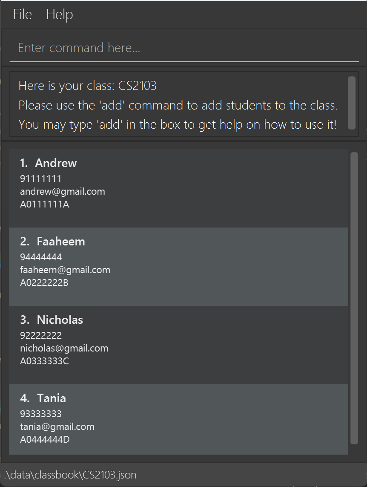
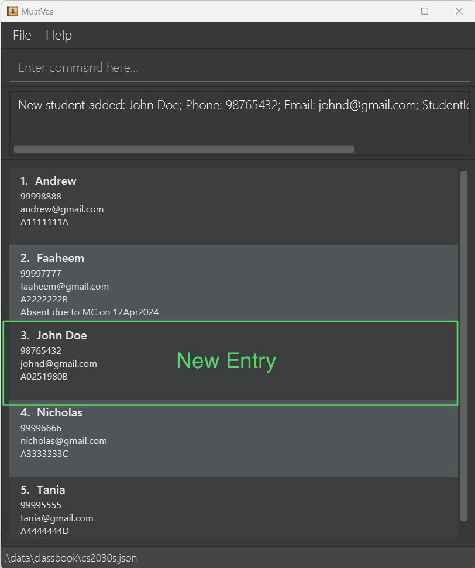
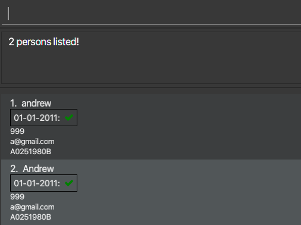

# MustVas User Guide

MustVas is a **desktop app for managing your tutorial contacts, optimized for use via a Command Line Interface** (CLI) while still having the benefits of a Graphical User Interface (GUI). If you can type fast, TutorHelperBot can get your contact management tasks done faster than traditional GUI apps.

<!-- * Table of Contents -->
<page-nav-print />

--------------------------------------------------------------------------------------------------------------------

## Quick start

1. Ensure you have Java `11` or above installed in your Computer.

1. Download the latest `addressbook.jar` from [here](https://github.com/se-edu/addressbook-level3/releases).

1. Copy the file to the folder you want to use as the _home folder_ for your TutorHelperBot.

1. Open a command terminal, `cd` into the folder you put the jar file in, and use the `java -jar addressbook.jar` command to run the application. 
   A GUI similar to the below should appear in a few seconds. Note how the app contains some sample data. 
   

1. Type the command in the command box and press Enter to execute it. e.g. typing **`help`** and pressing Enter will open the help window. 
   Some example commands you can try:

   * `view` : Lists all classes to select from.
  
   * `create c/CS2101` : Creates a class with course code `CS2101` in the Class Book.
  
   * `select 1` : Selects the specified class of index 1 from the class list.

   * `add n/John Doe p/98765432 e/johnd@example.com s/A0251980B ar/01-01-2011` : Adds a student named `John Doe` to the Student Book.

   * `delete 1` : Deletes the 3rd contact shown in the current list.

   * `clear` : Deletes all contacts.

   * `exit` : Exits the app.

1. Refer to the [Features](#features) below for details of each command.

--------------------------------------------------------------------------------------------------------------------

## Features

<box type="info" seamless>

**Notes about the command format:** 

* Words in `UPPER_CASE` are the parameters to be supplied by the user. 
  e.g. in `add n/NAME`, `NAME` is a parameter which can be used as `add n/John Doe`.

* Items in square brackets are optional. 
  e.g `n/NAME [ar/DATE]` can be used as `n/John Doe ar/01-01-2011` or as `n/John Doe`.

* Items with `…`​ after them can be used multiple times including zero times. 
  e.g. `[ar/DATE]…​` can be used as ` ` (i.e. 0 times), `ar/01-01-2011`, `ar/01-01-2011 ar/01-02-2011` etc.

* Parameters can be in any order. 
  e.g. if the command specifies `n/NAME p/PHONE_NUMBER`, `p/PHONE_NUMBER n/NAME` is also acceptable.

* Extraneous parameters for commands that do not take in parameters (such as `help`, `list`, `exit` and `clear`) will be ignored. 
  e.g. if the command specifies `help 123`, it will be interpreted as `help`.

* If you are using a PDF version of this document, be careful when copying and pasting commands that span multiple lines as space characters surrounding line-breaks may be omitted when copied over to the application.
</box>

### Viewing help : `help`

Shows a message explaning how to access the help page.

Format: `help`

### Creating a class : `create`

Simultaneously creates a class in the ClassBook and an empty StudentBook.

Format: `create c/CLASS_NAME`

Examples: 
* `create c/CS2101`
* `create c/CS2103T`

### Viewing the classes : `view`

Shows list of classes in result display.

Format: `view`

### Selecting a class to view : `select`

Shows a list of all students in the selected class.

Format: `select INDEX`

### Adding a student : `add`

Adds a student to the StudentBook.

Format: `add n/NAME p/PHONE_NUMBER e/EMAIL s/STUDENT_ID`

* `PHONE NUMBER` must consist of 8 digits.
* `STUDENT_ID` must begin with A, followed by 7 digits, and end with a capital letter. 
* There should not be any duplicate `EMAIL` or `PHONE_NUMBER`.
* If there are existing attendance records allocated to the existing students, the newly added student will have default status of '2' (meaning Valid Reason) for these existing attendance records. Please refer to the image below for illustration.

Examples:
* `add n/John Doe p/98765432 e/johnd@gmail.com s/A0251980B`

### Editing a student : `edit`

Edits an existing student in the StudentBook.

Format: `edit INDEX [n/NAME] [p/PHONE] [e/EMAIL] [s/STUDENT_ID]`

* Edits the student at the specified `INDEX`. The index refers to the index number shown in the displayed student list. The index **must be a positive integer** 1, 2, 3, …​
* At least one of the optional fields must be provided.
* Existing values will be updated to the input values.

Examples:
*  `edit 1 p/91234567 e/johndoe@example.com` Edits the phone number and email studentId of the 1st person to be `91234567` and `johndoe@example.com` respectively.
*  `edit 2 n/Betsy Crower ar/` Edits the name of the 2nd person to be `Betsy Crower` and clears all existing attendances.

### Adding an attendance record : `adda`

Add an attendance record to all exiting student in the studentId book.

Format: `adda ar/DATE`

* The format for `DATE` is `dd-MM-yyyy`.
* The entered date, `DATE`, must not exist in any of the student's existing list of attendance dates.
* The default value for status is '1' which represents 'Present'.

Examples:
*  `adda ar/01-01-2024` All the existing student will have a newly added attendance with date `01-01-2024` and a default status `1`.

### Editing an attendance for any number of person : `edita`

Edits the exiting attendance record in the student's list of attendance in the studentId book. **Any number of student** can be edited at one go.

Format: `edita INDEX1, INDEX2, …​ ar/DATE st/STATUS`

* The format for `DATE` is `dd-MM-yyyy`.
* Edits the student at the specified `INDEX(S)`. The index refers to the index number shown in the displayed student list. The index **must be a positive integer** 1, 2, 3, …​, up to the size of the class.
* At least one index is provided. **Multiple number of index** is allowed at a time, separated by commas.
* All the selected student will have their status of the selected attendance date, `DATE`, to be reflected to `STATUS`
* The entered date, `DATE`, must exist in the student's existing list of attendance dates.

Examples:
*  `edita 1 ar/01-01-2024 st/2` Edits the attendance status of the 1st student for `01-01-2024` to `2`, indicating absence with a valid reason.
*  `edita 2, 3 ar/01-01-2024 st/0` Edits the attendance status of the 2nd and 3rd student for `01-01-2024` to `0`, indicating absence.

### Deleting an attendance record : `dela`

Deletes the specified attendance date from all the student's list of attendance records in studentId book.

Format: `dela ar/DATE`

* The format for `DATE` is `dd-MM-yyyy`.
* The entered date, `DATE`, must exist in the student's existing list of attendance dates.
* Deletes the specified date, `DATE` from all the student's list of attendance records.

Examples:
* `dela ar/02-02-2024` Deletes the attendance record, `02-02-2024`, from all students' existing list of attendance records.

### Listing a class to view : `list`

Lists all students in the class.

Format: `list`

### Locating students by name : `find`

Finds students whose names contain any of the given keywords.

Format: `find KEYWORD [MORE_KEYWORDS]`

* The search is case-insensitive. e.g `andrew` will match `Andrew`
* The order of the keywords does not matter. e.g. `Nic Faaheem` will match `Faaheem Nic`
* Only the name is searched.
* Only full words will be matched e.g. `andr` will not match `andrew`
* Students matching at least one keyword will be returned (i.e. `OR` search).
  e.g. `Tania Tan` will return `Tania Low`, `Tania Ooi`

Examples:
* `find andrew` returns `andrew` and `Andrew`

  
* `find nic faaheem` returns `nic`, `faaheem` 
  

### Deleting a student : `delete`

Deletes the specified student from the StudentBook.

Format: `delete INDEX`

* Deletes the student at the specified `INDEX`.
* The index refers to the index number shown in the displayed student list.
* The index **must be a positive integer** 1, 2, 3, …​

Examples:
* `list` followed by `delete 2` deletes the 2nd person in the StudentBook.
* `find Betsy` followed by `delete 1` deletes the 1st student in the results of the `find` command.

### Removing a class: `rm`

Removes the specified class from the ClassBook.

Format: `rm INDEX`

* Deletes the class at the specified `INDEX`.
* The index refers to the index number shown in the displayed class list.
* The index **must be a positive integer** 1, 2, 3, …​
* Removes class from ClassBook and entire StudentBook from that class as well, i.e. [JAR file location]/data/classbook/[ClassName].json will be simultaneously deleted.

### Clearing all entries : `clear`

Clears all entries from the StudentBook in a selected class.

Format: `clear`

### Exiting the program : `exit`

Exits the program.

Format: `exit`

### Saving the data

ClassBook and StudentBook data are saved in the hard disk automatically after any command that changes the data. There is no need to save manually.

### Editing the data file

ClassBook and StudentBook data are saved automatically as a JSON file `[JAR file location]/data/classbook.json` and `[JAR file location]/data/classbook/[ClassName].json` respectively. Advanced users are welcome to update data directly by editing that data file.

<box type="warning" seamless>

**Caution:**
If your changes to the data file makes its format invalid, StudentBook will discard all data and start with an empty data file at the next run.  Hence, it is recommended to take a backup of the file before editing it. 
Furthermore, certain edits can cause the StudentBook to behave in unexpected ways (e.g., if a value entered is outside the acceptable range). Therefore, edit the data file only if you are confident that you can update it correctly.
</box>

### Archiving data files `[coming in v2.0]`

_Details coming soon ..._

--------------------------------------------------------------------------------------------------------------------

## FAQ

**Q**: How do I transfer my data to another Computer? 
**A**: Install the app in the other computer and overwrite the empty data file it creates with the file that contains the data of your previous AddressBook home folder.

--------------------------------------------------------------------------------------------------------------------

## Known issues

1. **When using multiple screens**, if you move the application to a secondary screen, and later switch to using only the primary screen, the GUI will open off-screen. The remedy is to delete the `preferences.json` file created by the application before running the application again.
2. **When using view after selecting a class**, if you try to view classes after having selected a class, the StudentBook of the previously selected class will still be on display, until you select another class.

--------------------------------------------------------------------------------------------------------------------

## Command summary

Action     | Format, Examples
-----------|----------------------------------------------------------------------------------------------------------------------------------------------------------------------
**Add**    | `add n/NAME p/PHONE_NUMBER e/EMAIL s/STUDENT_ID`   e.g., `add n/James Ho p/22224444 e/jamesho@example.com a/123, Clementi Rd, A1234567U `
**Clear**  | `clear`
**Delete** | `delete INDEX`  e.g., `delete 3`
**Edit**   | `edit INDEX [n/NAME] [p/PHONE_NUMBER] [e/EMAIL] [s/STUDENT_ID]​`  e.g.,`edit 2 n/James Lee e/jameslee@example.com`
**Find**   | `find KEYWORD [MORE_KEYWORDS]`  e.g., `find James Jake`
**List**   | `list`
**Help**   | `help`
**View**   | `view`
**Select** | `select INDEX`   e.g., `select 1`
**Create** | `create c/CLASS_NAME`   e.g., `create c/CS2103`
**Remove** | `rm INDEX`   e.g., `rm 2`
**Add Attendance**   | `adda [ar/DATE]`   e.g., `adda ar/01-01-2024`
**Edit Attendance**  | `edita INDEX1, INDEX2, …​ [ar/DATE] [st/STATUS]`   e.g., `edita 1 ar/01-01-2024 st/2`
**Delete Attendance** | `dela [ar/DATE]`   e.g., `dela ar/02-02-2024`
